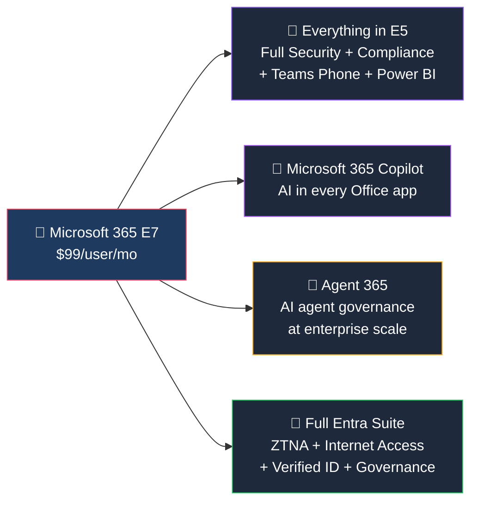

## Who Is Microsoft 365 E7 For?

E7 is for organisations that are **ready to go all-in on AI** — not just experimenting with Copilot, but deploying AI agents at scale with proper governance.

**E7 is right for you if:**

- ✅ You want **Copilot for all enterprise users** (not as an add-on)
- ✅ You're deploying **AI agents** and need governance at scale
- ✅ You want the **full Entra Suite** — Zero Trust Network Access, Internet Access, Verified ID
- ✅ You're already on E5 + Copilot and want Agent 365 for just $9 more
- ✅ You want a **single SKU** that covers everything — no add-on management

**You probably don't need E7 if:**

- ❌ You're not ready for Copilot yet
- ❌ You don't plan to use AI agents
- ❌ Budget is constrained — E3 or E5 covers most needs

## What's Inside Microsoft 365 E7?

### 🤖 Microsoft 365 Copilot (Included)

- AI assistant in **Word, Excel, PowerPoint, Outlook, Teams, OneNote**
- Summarise meetings, draft emails, analyse spreadsheets, create presentations
- Grounded on your **enterprise data** (emails, files, calendar) via Microsoft Graph
- **Copilot Studio** access for building custom agents and workflows
- Previously a $30/user/month add-on — now standard in E7

### 🤖 Agent 365 (New in E7)

| Feature | What It Does |
|---------|-------------|
| **Agent Inventory** | Central view of all AI agents across the tenant |
| **Security Policies** | Apply Conditional Access and DLP to agents, not just users |
| **Usage Tracking** | Monitor which agents are used, by whom, and how often |
| **Lifecycle Management** | Approve, deploy, retire agents with governance controls |
| **Entra + Defender + Purview Integration** | Agents get the same compliance treatment as human users |

> **💡 Why this matters:** As organisations deploy more AI agents (via Copilot Studio, Power Automate, custom apps), governing them becomes critical. Agent 365 is the management plane for the "agentic AI era."

Agent 365 is also available standalone at **$15/user/month** for organisations not ready for E7.

### 🔐 Full Entra Suite (Beyond E5)

| Feature | E5 | E7 |
|---------|:---:|:---:|
| Entra ID P2 (PIM, Identity Protection) | ✅ | ✅ |
| **Entra Private Access (ZTNA/VPN replacement)** | ❌ | ✅ |
| **Entra Internet Access (web filtering)** | ❌ | ✅ |
| **Entra Verified ID** | ❌ | ✅ |
| **Full Entra ID Governance** | Partial | ✅ |

## E5 vs E7 — Is the Upgrade Worth It?

| What You Get | E5 ($60) | E5 + Copilot ($90) | E7 ($99) |
|-------------|:--------:|:------------------:|:--------:|
| Full Security & Compliance | ✅ | ✅ | ✅ |
| Teams Phone + Power BI | ✅ | ✅ | ✅ |
| **Microsoft 365 Copilot** | ❌ | ✅ | ✅ |
| **Agent 365** | ❌ | ❌ | ✅ |
| **Full Entra Suite** | ❌ | ❌ | ✅ |
| **Monthly cost** | **$60** | **$90** | **$99** |

> **💡 The maths:** If you're buying Copilot for E5 users ($90/user), E7 at $99 gives you Agent 365 ($15 value) and the full Entra Suite for just $9 more. That's a no-brainer for organisations committed to AI.

## Frequently Asked Questions

**1. Is E7 available now?**

E7 reaches General Availability on **May 1, 2026**. It's available worldwide via Enterprise Agreement (EA), Cloud Solution Provider (CSP), and Web Direct.

**2. Can I mix E5 and E7 in the same tenant?**

Yes. Give E7 to power users, AI champions, and security teams. Keep E5 or E3 for users who don't need Copilot or Agent 365.

**3. What if I only want Agent 365, not the full E7?**

Agent 365 is available standalone at **$15/user/month**. You can add it to any E3 or E5 licence.

**4. Is E7 just E5 + Copilot repackaged?**

No. E7 adds the **full Entra Suite** (ZTNA, Internet Access, Verified ID) and **Agent 365** — neither of which is available in E5 even with the Copilot add-on. It's a genuine upgrade.

