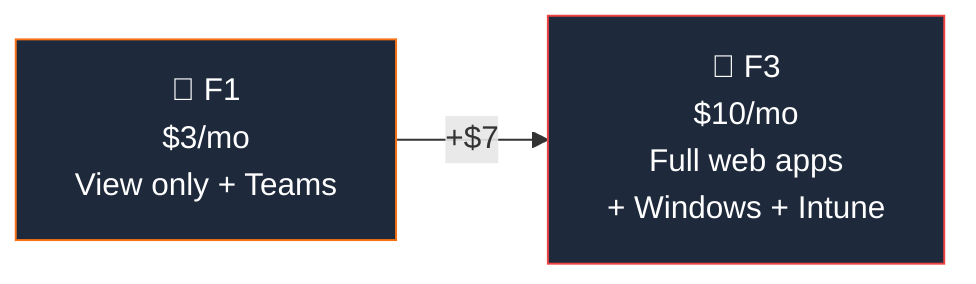
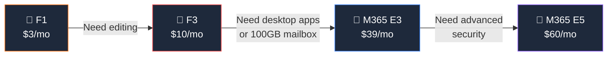

## Who Are Frontline Plans For?

Frontline plans are for **workers who don't sit at desks** — retail associates, healthcare workers, factory floor staff, delivery drivers, and field technicians. They primarily use **mobile devices and shared terminals**.

**Frontline is right for:**

- ✅ **Shift workers** who need Teams for communication and scheduling
- ✅ **Retail staff** using shared devices (kiosks, shared tablets)
- ✅ **Healthcare workers** who need mobile access to schedules and patient info
- ✅ **Field technicians** who need mobile access to work orders and documentation
- ✅ **Factory/warehouse workers** needing safety communications and task management
- ✅ Organisations wanting to **include every employee** in Teams without high per-user cost

**Frontline is NOT right for:**

- ❌ Users who need **desktop Office apps** — use [M365 E3](/licensing/microsoft-365-e3/) or [Business Standard](/licensing/microsoft-365-business-standard/)
- ❌ Users who need a **full email mailbox** — F1/F3 only have 2 GB mailboxes
- ❌ Users who need **Microsoft 365 Copilot** — not eligible on frontline plans
- ❌ **Knowledge workers** who create documents daily — use enterprise plans

## F1 vs F3 — Which Frontline Plan?

| Feature | F1 ($3) | F3 ($10) |
|---------|:-------:|:--------:|
| Teams (chat, meetings, walkie-talkie) | ✅ | ✅ |
| Web Office Apps | **View only** | **Full editing** |
| Exchange | **Kiosk (calendar only)** | **2 GB mailbox** |
| SharePoint | Read-only | Full access |
| OneDrive | 2 GB | 2 GB |
| Entra ID P1 (Conditional Access) | ✅ | ✅ |
| **Intune P1 (device management)** | ❌ | ✅ |
| **Windows Enterprise** | ❌ | ✅ |
| **Shifts (schedule management)** | ✅ | ✅ |
| **Walkie Talkie (push-to-talk)** | ✅ | ✅ |
| **Tasks / Updates apps** | ✅ | ✅ |
| **Viva Connections** | ✅ | ✅ |
| **Copilot eligible** | ❌ | ❌ |

> **💡 Rule of thumb:** If workers just need to **read** documents and use Teams → F1 ($3). If they need to **create and edit** content, or you need to manage their devices with Intune → F3 ($10).

## Frontline-Specific Features

These features are designed specifically for frontline workers and work across both F1 and F3:

| Feature | What It Does | Use Case |
|---------|-------------|----------|
| **Shifts** | Schedule management for shift workers | Managers create rosters, workers swap shifts |
| **Walkie Talkie** | Push-to-talk over Teams | Instant voice comms on the floor — replaces physical radios |
| **Tasks** | Task assignment and tracking | Head office pushes tasks to all stores |
| **Updates** | Structured check-ins from workers | Start-of-shift safety checks, status reports |
| **Viva Connections** | Mobile intranet dashboard | Company news, announcements, policies |
| **Approvals** | Request and approve time off, expenses | Works inside Teams with Power Automate |

## Frontline vs Enterprise — When to Upgrade

| Feature | F1 ($3) | F3 ($10) | [E3](/licensing/microsoft-365-e3/) ($39) | [E5](/licensing/microsoft-365-e5/) ($60) |
|---------|:-------:|:--------:|:--------:|:--------:|
| Web/Mobile Apps | View | Edit | Edit | Edit |
| **Desktop Apps** | ❌ | ❌ | ✅ | ✅ |
| Exchange | Kiosk | 2 GB | **100 GB** | **100 GB** |
| OneDrive | 2 GB | 2 GB | **Unlimited** | **Unlimited** |
| Security suite | Basic | Basic | P1 | **P2** |
| **Copilot eligible** | ❌ | ❌ | ✅ | ✅ |
| Per-user cost | **$3** | **$10** | **$39** | **$60** |

> **💡 The mixed licensing play:** Most organisations give F1 or F3 to frontline workers ($3-10/user) and [E3](/licensing/microsoft-365-e3/) or [E5](/licensing/microsoft-365-e5/) to office staff ($39-60/user). A 5,000-person company with 3,000 frontline F1 and 2,000 office E3 saves **$216,000/year** vs giving everyone E3.

## Common Scenarios

| Scenario | Recommended Plan | Why |
|----------|:----------------:|-----|
| Retail associates with shared tablets | **F1** ($3) | Only need Teams comms and view access |
| Healthcare nurses with personal phones | **F3** ($10) | Need to edit notes, manage devices via Intune |
| Warehouse workers with scanners | **F1** ($3) | Push-to-talk, task checklists, no document editing |
| Field technicians with company laptops | **F3** ($10) | Need Windows Enterprise + Intune + editing |
| Delivery drivers with company phones | **F1** ($3) | Teams navigation, task updates, no documents |

## Frequently Asked Questions

**1. What is the difference between F1 and F3?**

F1 ($3) gives view-only web apps, Teams, and basic identity. F3 ($10) adds full web/mobile app editing, Windows Enterprise, and Intune for device management.

**2. Can frontline workers use Copilot?**

Not currently. [Microsoft 365 Copilot](/licensing/microsoft-365-copilot/) requires E3, E5, Business Standard, or Business Premium as a base plan. Frontline plans (F1/F3) are not eligible.

**3. What mailbox size do frontline workers get?**

F1 gets an Exchange Kiosk licence (Teams calendar only, no real mailbox). F3 gets a 2 GB mailbox. Both are much smaller than enterprise plans (100 GB). Frontline workers primarily use Teams, not email.

**4. Can I mix frontline and enterprise licences in the same tenant?**

Absolutely. Most organisations give F1/F3 to frontline workers and [E3](/licensing/microsoft-365-e3/)/[E5](/licensing/microsoft-365-e5/) to office-based staff. This is the recommended approach and is fully supported by Microsoft.

**5. Do frontline workers get OneDrive?**

F1 gets 2 GB OneDrive (very limited). F3 also gets 2 GB. For meaningful file storage, use shared SharePoint sites instead of individual OneDrive.

**6. Can frontline workers join Teams meetings with desktop users?**

Yes. Teams works the same across all licence types. Frontline workers can join meetings, chat, and collaborate with any M365 user.
