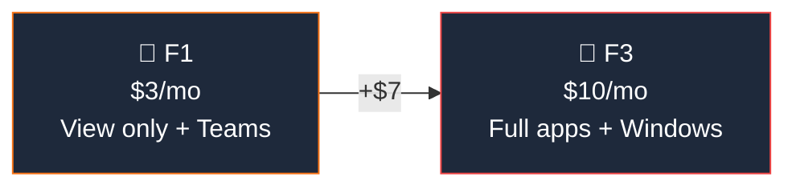

## Who Are Frontline Plans For?

Frontline plans are for **workers who don't sit at desks** — retail associates, healthcare workers, factory floor staff, delivery drivers, and field technicians. They primarily use **mobile devices and shared terminals**.

**Frontline is right for:**
- ✅ **Shift workers** who need Teams for communication and scheduling
- ✅ **Retail staff** using shared devices (kiosks, shared tablets)
- ✅ **Field workers** who need mobile access to company info
- ✅ Organisations wanting to **include every employee** in Teams without high per-user cost

## F1 vs F3

| Feature | F1 ($3) | F3 ($10) |
|---------|:-------:|:--------:|
| Teams (chat, meetings) | ✅ | ✅ |
| Web Office Apps (view only) | ✅ (view) | ✅ (edit) |
| Exchange (2 GB) | ✅ | ✅ |
| SharePoint (read) | ✅ | ✅ |
| Entra ID P1 | ✅ | ✅ |
| Intune P1 | ✅ | ✅ |
| **Full web/mobile app editing** | ❌ | ✅ |
| **Windows Enterprise** | ❌ | ✅ |

> **💡 Rule of thumb:** If workers just need to **read** documents and use Teams → F1. If they need to **create and edit** content → F3.

## Frequently Asked Questions

**1. Can I mix frontline and enterprise licences?**

Absolutely. Most organisations give F1/F3 to frontline workers and E3/E5 to office-based staff. This is the recommended approach.

**2. Do frontline workers get OneDrive?**

F1 gets 2 GB OneDrive (very limited). F3 gets 2 GB as well. For meaningful file storage, use shared SharePoint sites instead.

**3. Can frontline workers join Teams meetings with desktop users?**

Yes — Teams works the same across all licence types. Frontline workers can join meetings, chat, and collaborate with any M365 user.
