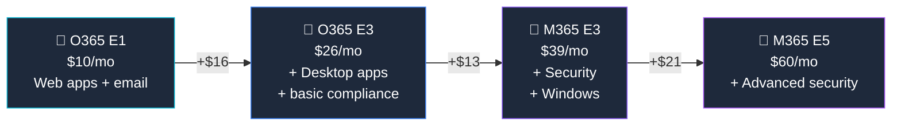

## Who Is Office 365 E1 For?

E1 is the **cheapest enterprise plan with no user limit** — for organisations that need email, Teams, and cloud storage but **don't need desktop Office apps** or the security suite.

**E1 is right for you if:**

- ✅ Your team works primarily in **web browsers** or on mobile devices
- ✅ You need **email (50 GB), Teams, SharePoint, and OneDrive** at the lowest enterprise cost
- ✅ You have **300+ users** (no upper limit — unlike Business plans)
- ✅ Desktop Office apps are **not required** (or provided separately via Microsoft 365 Apps)
- ✅ Security is handled by **separate products** (standalone Defender, Intune, etc.)

**E1 is probably not enough if:**

- ❌ Users need **desktop Word, Excel, or PowerPoint** — upgrade to [O365 E3](/licensing/office-365-e3/) ($26)
- ❌ You want **security + device management** — upgrade to [M365 E3](/licensing/microsoft-365-e3/) ($39)
- ❌ You want **Copilot** — E1 is not eligible; minimum is [M365 E3](/licensing/microsoft-365-e3/)
- ❌ You have **under 300 users** — [Business Basic](/licensing/microsoft-365-business-basic/) ($7) is $3/user cheaper

> **⚠️ "Microsoft 365 E1" doesn't exist.** If you're searching for "M365 E1", you're probably looking for either this page (Office 365 E1) or [Microsoft 365 E3](/licensing/microsoft-365-e3/) — the lowest plan in the Microsoft 365 enterprise suite.

## What's Included in Office 365 E1

### 📧 Productivity & Communication

| Feature | What You Get |
|---------|-------------|
| **Web & Mobile Office Apps** | Word, Excel, PowerPoint, Outlook — browser and iOS/Android only |
| **Exchange Online** | **50 GB mailbox** + 50 GB archive, shared mailboxes, custom domain email |
| **Microsoft Teams** | Chat, video meetings, screen sharing, webinars |
| **SharePoint Online** | Team sites, document libraries, intranet |
| **OneDrive for Business** | **1 TB** cloud storage per user |
| **Microsoft Forms** | Surveys, quizzes, and polls |
| **Microsoft Planner** | Task management boards |
| **Microsoft Stream** | Video hosting and sharing |
| **Microsoft Bookings** | Online appointment scheduling |

### ⚠️ What E1 Does NOT Include

| Missing Feature | Where To Get It |
|----------------|-----------------|
| Desktop Office apps | [O365 E3](/licensing/office-365-e3/) ($26) or [M365 E3](/licensing/microsoft-365-e3/) ($39) |
| Intune / device management | [M365 E3](/licensing/microsoft-365-e3/) ($39) |
| Entra ID P1 / Conditional Access | [M365 E3](/licensing/microsoft-365-e3/) ($39) |
| Defender for Endpoint | [M365 E3](/licensing/microsoft-365-e3/) ($39) or standalone |
| DLP / Sensitivity Labels | [O365 E3](/licensing/office-365-e3/) ($26) |
| Microsoft 365 Copilot | Not eligible — need [M365 E3](/licensing/microsoft-365-e3/) base |

## E1 vs E3 vs M365 E3 — The Upgrade Path

| Feature | E1 ($10) | [O365 E3](/licensing/office-365-e3/) ($26) | [M365 E3](/licensing/microsoft-365-e3/) ($39) | [M365 E5](/licensing/microsoft-365-e5/) ($60) |
|---------|:--------:|:-------------:|:-------------:|:-------------:|
| Web & Mobile Office Apps | ✅ | ✅ | ✅ | ✅ |
| **Desktop Office Apps** | ❌ | ✅ | ✅ | ✅ |
| Exchange mailbox | 50 GB | **100 GB** | **100 GB** | **100 GB** |
| Teams, SharePoint, OneDrive | ✅ | ✅ | ✅ | ✅ |
| **DLP + Sensitivity Labels** | ❌ | ✅ | ✅ | ✅ |
| **Intune + Entra ID P1** | ❌ | ❌ | ✅ | ✅ |
| **Defender for Endpoint** | ❌ | ❌ | P1 | **P2** |
| **Windows Enterprise** | ❌ | ❌ | ✅ | ✅ |
| **Teams Phone + Power BI** | ❌ | ❌ | ❌ | ✅ |
| **Copilot eligible** | ❌ | ❌ | ✅ | ✅ |

> **💡 The honest recommendation:** E1 saves money ($10 vs $39) but you lose desktop apps, security, and Copilot eligibility. Most IT admins recommend [M365 E3](/licensing/microsoft-365-e3/) for new enterprise deployments — it's the complete package.

## E1 vs Business Basic — Which Budget Plan?

| Feature | [Business Basic](/licensing/microsoft-365-business-basic/) ($7) | Office 365 E1 ($10) |
|---------|:--------------:|:-----------:|
| Web & Mobile Apps | ✅ | ✅ |
| Exchange (50 GB) | ✅ | ✅ |
| Teams, SharePoint, OneDrive | ✅ | ✅ |
| **User limit** | **300 max** | **Unlimited** |
| **Archive mailbox** | ❌ | ✅ (50 GB) |
| **eDiscovery** | ❌ | Basic |
| Price difference | $3/user cheaper | $3/user more |

> **💡 Decision rule:** Under 300 users → Business Basic ($7). Over 300 or need archive/eDiscovery → E1 ($10).

## Frequently Asked Questions

**1. Does Office 365 E1 include desktop Office apps?**

No. E1 only includes web and mobile versions of Office apps. For desktop apps (installed Word, Excel, etc.), you need [Office 365 E3](/licensing/office-365-e3/) ($26) or [Microsoft 365 E3](/licensing/microsoft-365-e3/) ($39).

**2. What is the difference between Office 365 E1 and Microsoft 365 Business Basic?**

They're very similar — both offer web apps, email, and Teams. [Business Basic](/licensing/microsoft-365-business-basic/) ($7) is cheaper but capped at 300 users. E1 ($10) has no user limit and is designed for enterprises.

**3. Is there a Microsoft 365 E1?**

No. There is no "Microsoft 365 E1" product. The entry-level enterprise plan is Office 365 E1 (productivity only). For the full Microsoft 365 suite with security, the lowest enterprise plan is [Microsoft 365 E3](/licensing/microsoft-365-e3/) ($39).

**4. Can I add Copilot to Office 365 E1?**

No. [Microsoft 365 Copilot](/licensing/microsoft-365-copilot/) requires Microsoft 365 E3, E5, Business Standard, or Business Premium as a base plan. Office 365-only plans are not eligible.

**5. Is Office 365 E1 being retired?**

No. E1 remains available and is still sold through EA, CSP, and Web Direct. It's valid for cost-conscious enterprises that don't need desktop apps or the security suite.

**6. What mailbox size does E1 provide?**

Office 365 E1 provides a 50 GB Exchange mailbox per user, plus 50 GB archive mailbox. This is the same as Business Basic but half of the 100 GB in Office 365 E3.
