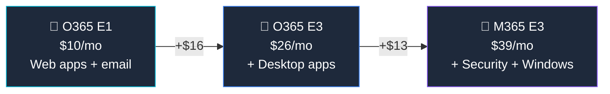

## Who Is Office 365 E1 For?

E1 is the **cheapest enterprise plan** — for organisations that need email, Teams, and cloud storage but **don't need desktop Office apps**. Users work entirely in the browser or on mobile.

**E1 is right for you if:**
- ✅ Your team works primarily in **web browsers** or on mobile devices
- ✅ You need **email (50 GB), Teams, SharePoint, and OneDrive** at the lowest cost
- ✅ You have **300+ users** (no upper limit)
- ✅ Desktop Office apps are **not required** (or provided separately)

## E1 vs E3 vs M365 E3

| Feature | E1 ($10) | O365 E3 ($26) | M365 E3 ($39) |
|---------|:--------:|:-------------:|:-------------:|
| Web & Mobile Office Apps | ✅ | ✅ | ✅ |
| **Desktop Office Apps** | ❌ | ✅ | ✅ |
| Exchange (mailbox) | 50 GB | 100 GB | 100 GB |
| Teams, SharePoint, OneDrive | ✅ | ✅ | ✅ |
| **Intune, Entra ID P1** | ❌ | ❌ | ✅ |
| **Windows Enterprise** | ❌ | ❌ | ✅ |

## Frequently Asked Questions

**1. Can I install Word and Excel on my PC with E1?**

No. E1 only provides web and mobile versions. You can view and edit documents in the browser but cannot install desktop apps.

**2. Is E1 being retired?**

No. E1 remains available and is still a valid option for cost-conscious enterprises. However, most new deployments choose Microsoft 365 E3 for the security features.
