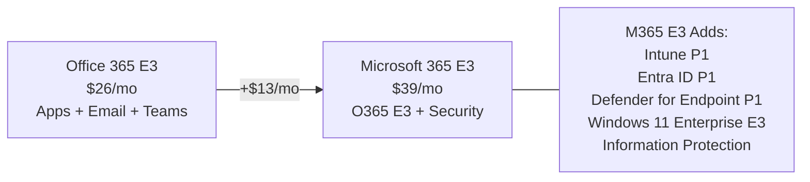

## Who Is Office 365 E3 For?

Office 365 E3 is the **productivity-only enterprise plan** — full desktop Office apps, 100 GB email, and Teams, but **without the security and device management** that Microsoft 365 E3 includes.

**O365 E3 is right for you if:**
- ✅ You need **desktop Office apps** for all users
- ✅ Security is handled by **third-party tools** (CrowdStrike, Okta, etc.)
- ✅ You manage devices with **SCCM or a third-party MDM**
- ✅ You want to save $13/user vs Microsoft 365 E3

**Most organisations should choose M365 E3 instead if:**
- ❌ You don't have separate security tooling
- ❌ You want Intune for cloud device management
- ❌ You need Conditional Access for zero-trust security

## Office 365 E3 vs Microsoft 365 E3

> **💡 Plain English:** Office 365 E3 is like buying a car without insurance. Microsoft 365 E3 is the car WITH insurance. For $13 more, most organisations should get the insurance.

## What's Included

- **Desktop Office Apps** — Word, Excel, PowerPoint, Outlook, OneNote, Access, Publisher
- **Exchange Online** — 100 GB mailbox, shared mailboxes, in-place archiving
- **Teams** — Chat, video meetings, webinars, live events
- **SharePoint Online** — Intranet, document libraries
- **OneDrive** — Unlimited storage (5+ users)
- **Basic DLP** — Data Loss Prevention for email and SharePoint
- **eDiscovery (Standard)** — Content search and legal hold

## Frequently Asked Questions

**1. Can I upgrade from O365 E3 to M365 E3?**

Yes — simple licence change in the admin centre. Users keep all their data. The security features (Intune, Entra, Defender) activate automatically.

**2. Is Office 365 E3 being phased out?**

Not officially, but Microsoft is clearly pushing Microsoft 365 E3 as the default. Most new customers start with M365 E3. O365 E3 remains available for specific use cases.
