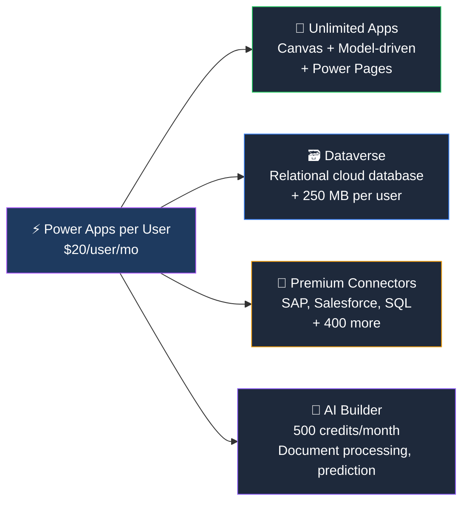

## Who Is Power Apps per User For?

Power Apps per User is for **citizen developers and power users** who build or use multiple business apps. If you're building more than one or two apps, per User is the most cost-effective option.

**Per User is right for you if:**

- ✅ You build or use **multiple Power Apps** regularly
- ✅ You need **Dataverse** (relational database) for your app data
- ✅ You use **premium connectors** — SAP, Salesforce, SQL Server, Dataverse
- ✅ You want **AI Builder** credits for document processing, prediction, or text analysis
- ✅ You're a **citizen developer** building apps for your team

## What's Included

| Feature | M365 Included (Basic) | Per User ($20) |
|---------|:---------------------:|:--------------:|
| Canvas apps | ✅ (standard connectors only) | ✅ (all connectors) |
| Model-driven apps | ❌ | ✅ |
| **Dataverse** | ❌ | ✅ (250 MB) |
| **Premium connectors** | ❌ | ✅ |
| **AI Builder** | ❌ | ✅ (500 credits) |
| **Power Pages** | ❌ | ✅ |
| Custom connectors | ✅ | ✅ |

> **💡 The M365 trap:** Many admins think "Power Apps is included in E3/E5." It is — but only with standard connectors and no Dataverse. The moment you need a proper database or premium connector, you need the per User licence.

## Frequently Asked Questions

**How many apps can I build?**
Unlimited. Per User has no app limit — you can build and run as many canvas and model-driven apps as you want.

**What is Dataverse?**
Dataverse is Microsoft's managed relational database for Power Platform. Think of it as the "backend" for your apps — tables, relationships, security roles, business rules, and APIs built in.

**Can I share apps with users who don't have a Power Apps licence?**
Users who RUN your apps need their own licence. Per App ($10/app/user/month) is good for users who only need one specific app. Per User ($20) is better for users who run multiple apps.
