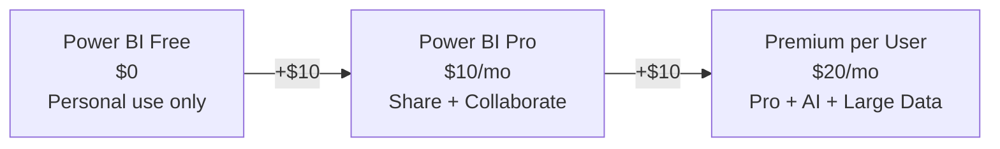

## Who Is Power BI Pro For?

Power BI Pro is for **analysts and business users** who create and share interactive reports. It's the entry point to Microsoft's BI platform.

**Pro is right for you if:**

- ✅ You create **dashboards and reports** from multiple data sources
- ✅ You need to **share reports** with colleagues (not just view them yourself)
- ✅ You connect to **SQL, Excel, SharePoint, D365, and 100+ data sources**
- ✅ You want **scheduled data refresh** (up to 8x per day)

## Free vs Pro vs Premium per User

| Feature | Free | Pro ($10) | Premium/User ($20) |
|---------|:----:|:---------:|:------------------:|
| Create reports in Desktop | ✅ | ✅ | ✅ |
| **Publish to Power BI Service** | ❌ | ✅ | ✅ |
| **Share with colleagues** | ❌ | ✅ | ✅ |
| Scheduled refresh | ❌ | 8x/day | 48x/day |
| Dataset size limit | 1 GB | 1 GB | **100 GB** |
| **Paginated reports** | ❌ | ❌ | ✅ |
| **AI features (AutoML, Cognitive)** | ❌ | ❌ | ✅ |
| **Deployment pipelines** | ❌ | ❌ | ✅ |

> **💡 If you're on E5, you already have it:** Power BI Pro is included in M365 E5 and E7. Don't buy it separately for those users.

## Frequently Asked Questions

**1. Do report VIEWERS need a Pro licence?**

Yes — anyone who views shared Pro reports needs their own Pro licence. Exception: if your org has Power BI Premium capacity (P SKU), viewers can access reports without individual licences.

**2. Can I embed Power BI in Teams?**

Yes. Power BI tabs in Teams channels and dashboards in Teams meetings are fully supported with Pro licences.

**3. Is Pro enough for my data team?**

For most business analysts, Pro is sufficient. Data engineers working with large datasets (>1 GB), needing dataflows, or paginated reports should consider Premium per User ($20).

