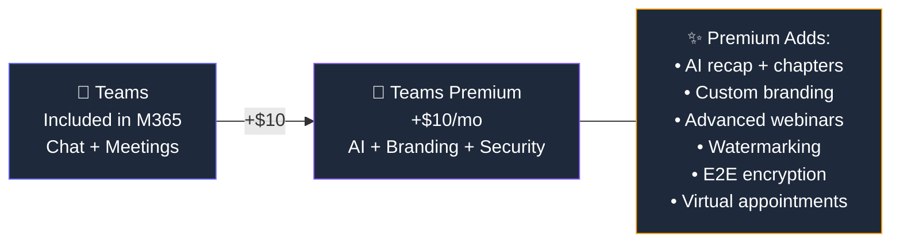

## Who Is Teams Premium For?

Teams Premium is for organisations that want to **level up their meeting experience** — AI-powered recaps, professional branding, and enterprise-grade meeting security.

**Teams Premium is right for you if:**

- ✅ Your team spends a **lot of time in meetings** and wants AI-generated recaps
- ✅ You host **external webinars** and want custom branding (logo, colours, registration)
- ✅ You discuss **sensitive information** and need watermarking and encryption
- ✅ You want **intelligent recap** — chapters, action items, and speaker timeline
- ✅ You run **virtual appointments** (healthcare, consulting, customer meetings)

## Standard Teams vs Teams Premium

| Feature | Standard Teams | Teams Premium (+$10) |
|---------|:-------------:|:--------------------:|
| Chat, meetings, calling | ✅ | ✅ |
| Meeting recording & transcription | ✅ | ✅ |
| **AI intelligent recap** | ❌ | ✅ |
| **Chapters & action items** | ❌ | ✅ |
| **Speaker timeline** | ❌ | ✅ |
| **Custom meeting branding** | ❌ | ✅ |
| **Advanced webinar features** | ❌ | ✅ |
| **Meeting watermarking** | ❌ | ✅ |
| **Sensitivity labels for meetings** | ❌ | ✅ |
| **End-to-end encryption (1:1)** | ❌ | ✅ |
| **Virtual appointments** | Basic | Advanced |

> **💡 The time-saver:** If you miss a meeting, intelligent recap generates a full summary with chapters (grouped by topic), action items assigned to people, and a speaker timeline. This alone is worth the $10 for busy professionals.

## Frequently Asked Questions

**1. Can I mix Teams Premium and standard users?**

Yes. Only users with Premium licences get the premium features. Meetings with mixed attendees work fine — Premium users see the AI recap, others don't.

**2. Does Teams Premium replace Teams Phone?**

No. Teams Premium is about **meeting features**. Teams Phone ($8/user/month) is about **making phone calls**. They're separate add-ons that complement each other.

**3. Do I need Teams Premium for ALL meeting participants?**

Only the **meeting organiser** needs Premium to enable branded meetings and advanced webinars. For AI recap, each user who wants to view the recap needs their own Premium licence.

